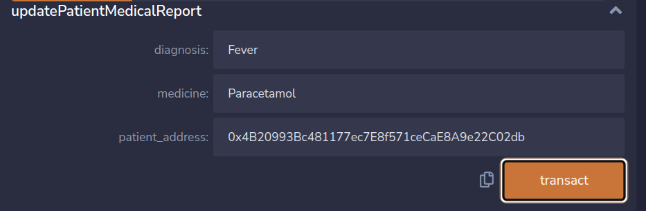

# Patient-Record-Management-System

Patient Record Management System based on blockchain technology

## Running in [Remix IDE](https://remix.ethereum.org/)

### Phase One

1. Intial Procedure

   - Copy the code present in the `contracts/Record.sol`
   - Paste it in the Remix IDE inside `contracts/` folder in the `<filename>.txt`
   - Then compile it,
   - And finally deploy it.

2. First of all we will add doctor

   - Copy any address that is provided to you expect that address that you have used to deploy.
   - Provide necessary argument to the function
     
   - Go ahead and click transact button.

     _Make sure that you are in owner account not other account_

3. Now we will check if Doctor was added or not.

   - We have another function `doctors` which is used to get the Doctor details.
   - You need to supply the Doctor address(one that you have given while adding doctor) and click `call` button.
     
   - We can the detail that we have add.

4. Now lets go ahead and register the doctor.

   - You can find there another method called `registerDoctor()` which takes `doctor_address` as a parameter.
   - Provide the `doctor_address` and click transact to register the doctor.
     

5. Now its time to add patient to our contract.

   - There is a method `addPatients` through which you can add patients
   - Provide necessary arguments. And provide new address that you haven't used in the address section of parameter.

     

   - Then click on transact button.

6. Lets check if our **Patient** is added or not.

   - It is same as that of checking Doctor.
   - Go on and find `patients` section, provide address of patient and click `call` button.

   

## Phase Two

Suppose you are sufferring from fever and you visit the doctor and doctor examines you give you medicine. But suffering from disease is life long process and one cannot rememeber all those medication. So by this contract we are going to store the medical report of the Patients.

But before getting start, ** We only want our medical report to be update by the doctor whom we have be diagnosis** so first of all we will give Doctor permission to update our medical report and then Doctor will update and then after we will remove Doctor Permission to update medical reports.

1. Giving Permission to Doctor to update Medical Reports.

   - There is a method called `givePermission()` which need `doctor_address` as a parameters.
   - Provide the address of the doctor that we have added and registered.
   - Before clicking `transact` make sure you are in patient address not owner.
     

   - When you are done click `transact`.

     

2. Checking the permission

   - Find the method `checkPermision()` provide the address of patient and doctor and click `call` button.

     

3. Writing Medical Reports

   - As only Doctor write the report so switch to you doctor account.
   - Find the method name, `updatePatientMedicalReport()`.
   - Provide the necessary argument and click `transact`. Make sure that you have enter correct `patient_address`.

     

     **Lets add another more medical Report for same patient**

     

4. Retrieving those written Medical Report

   - There is a method `getMedicalReports()` which is use to get the Medical Report of the Patient.
   - Provide the address of the patient and click `transact`.

     

     **There is another function which return one report at once and you need to provide another argument called index**

     
     

5. Lastly removing permission

   - There is a method `removePermission()`.
   - Switch to the patient account.
   - Provide the address of doctor whose permission to update medical report you want to remove.
   - Press `transact`.
     

     **Checking if the permission is removed or not**
     

## Setting up Project(Local)

You can also setup this project in you local machine, run test case and integrate with frontend of Dapp you have created.

### Requirement

- `nodejs`

### Installation

#### For Compilation of Solidity Files

- First of all install the node modules along with hardhat

  ```sh
  npm install --save-dev hardhat
  ```

  _You can see that it has created a folder `node_modules`_

- Compile the solidity file

  ```sh
  npx hardhat compile
  ```

  _It will show "Compiled 1 solidity file successfully"_

#### For testing Solidity files

- For testing you need to install some other packages. So go on install it

  ```sh
  npm install --save-dev @nomiclabs/hardhat-ethers ethers @nomiclabs/hardhat-waffle ethereum-waffle chai
  ```

- Run the test script

  ```sh
  npx hardhat test
  ```

#### Deployment Script

Inside the script folder you can find your deployment script.

1. Open two terminal
2. First of all install the require library.

   ```sh
   npm install --save-dev @nomiclabs/hardhat-ethers ethers @nomiclabs/hardhat-waffle ethereum-waffle chai
   ```

3. One one terminal run
   ```sh
    npx hardhat node
   ```
4. On another terminal, run:

```sh
  npx hardhat run scripts/deploy_record.js --network localhost
```

5. You will notice some change on the terminal where you have execute `npx hardhat node` command and on your working tree a folder will be created which contain the address used to deploy contract and ABI code of smart contract.
